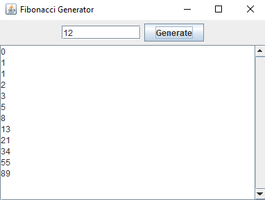

# Instructions

## Simple UI - Fibonacci Application

1. Run `java '.\Simple UI\FibonacciFrame.java'`

Good for exploring:
1. How to organize elements
2. How to detect events
3. How to update UI

## Multiple UI - To-do Kanban board

1. Compile
    -  `javac Multiple_UI/*.java .\Multiple_UI\Controller\*.java .\Multiple_UI\Events\*.java .\Multiple_UI\Panels\*.java`
2.  Execute
    -  `java .\Multiple_UI\App.java`

Good for exploring:
1. More complex organization of elements
2. Other Swing API (e.g. colors, borders, etc...)
3. Creating subclasses of elements
4. Connecting Controller (Data manager) with UI Elements